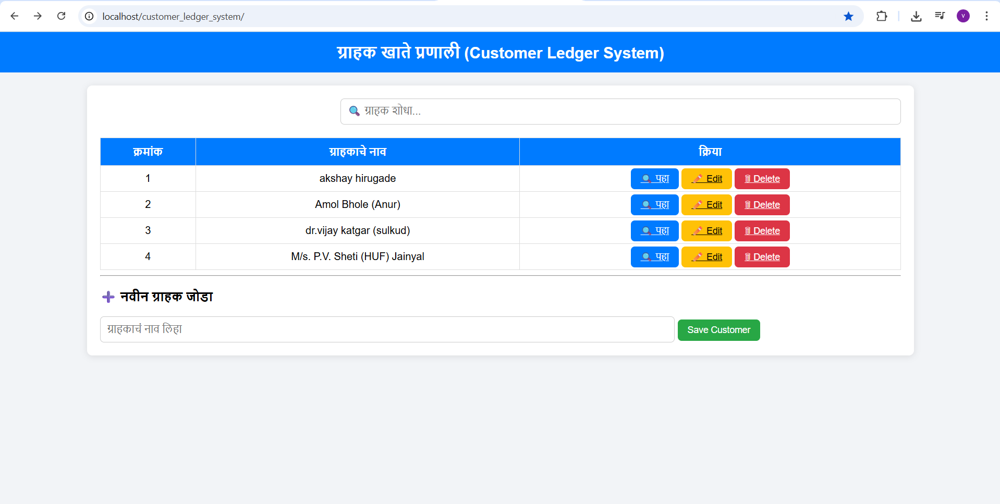
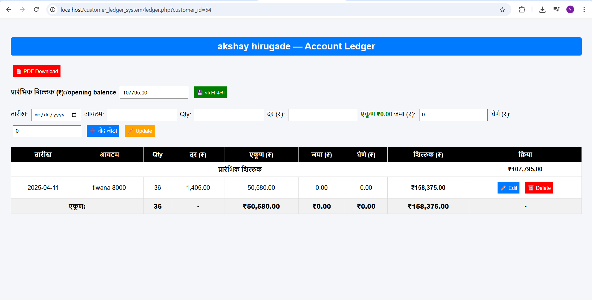
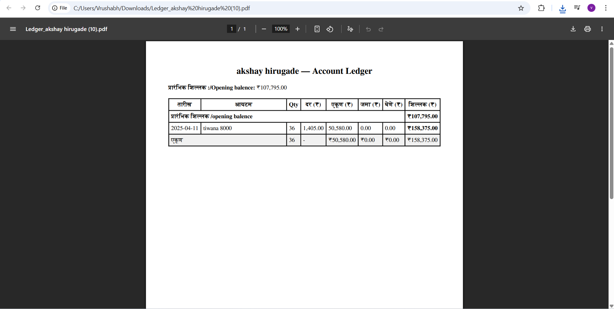

# 🧾 Customer Ledger System (Offline PHP Application)

A simple **Customer Account Ledger System** built using **PHP**, **MySQL**, and **mPDF**, designed for managing daily customer transactions, generating balance sheets, and downloading reports in **PDF format (Marathi supported)** — all offline through **XAMPP**.

---
## Home Page

## Account Ledger

## Bill generated in PDF Format

## 🚀 Features

✅ Add, edit, and delete customer transaction records  
✅ Manage opening balance for each customer  
✅ Auto-calculate total balance, deposits, borrows, and item totals  
✅ Generate printable **PDF ledger reports (with Marathi support)**  
✅ Easy-to-use web interface — built with HTML, CSS, and PHP  
✅ Fully offline — works with XAMPP/MySQL on your local computer  

---

## 🛠️ Technologies Used

| Component | Technology |
|------------|-------------|
| Backend | PHP 8.x |
| Database | MySQL (via XAMPP) |
| Frontend | HTML5, CSS3, JavaScript |
| PDF Library | [mPDF](https://mpdf.github.io/) |
| Font Support | FreeSerif (for Marathi / Devanagari text) |

---

## 📄 PDF Marathi Support

This system uses the **FreeSerif** font in mPDF, which supports **Marathi (Devanagari)** text by default.  
No extra fonts or configuration are needed.

> 💡 If your PDF still shows boxes or missing letters, ensure your PHP files are saved as **UTF-8 (without BOM)**.

## 📜 License

This project is open-source under the **MIT License** — you’re free to use, modify, and share it for educational or business purposes.

---

## 👨‍💻 Author

**Name: Vrushabh Jitendra Patil**  
🎓 B.Tech – Computer Science Engineering  
📍 Nipani, Karnataka, India  

GitHub: [@vpatil7731](https://github.com/vpatil7731)
